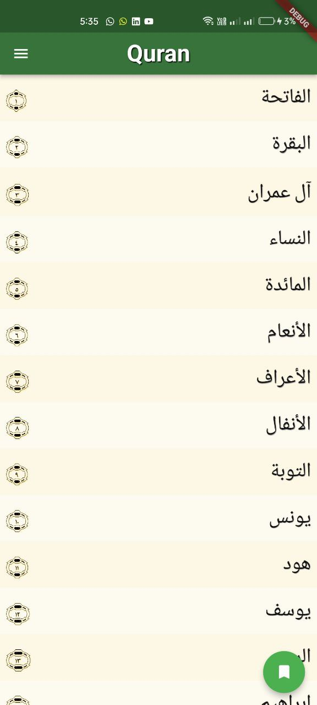
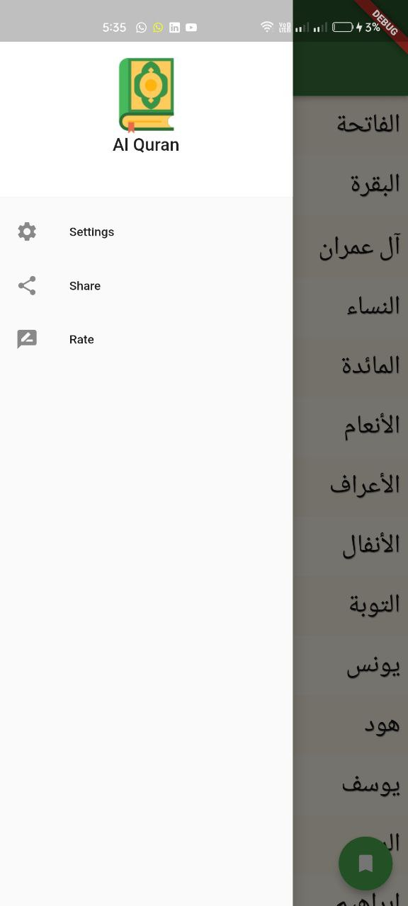
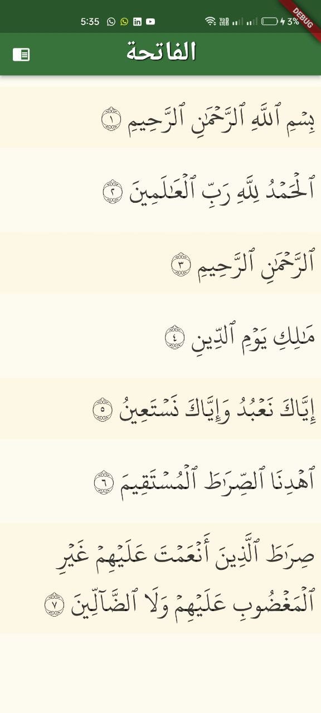
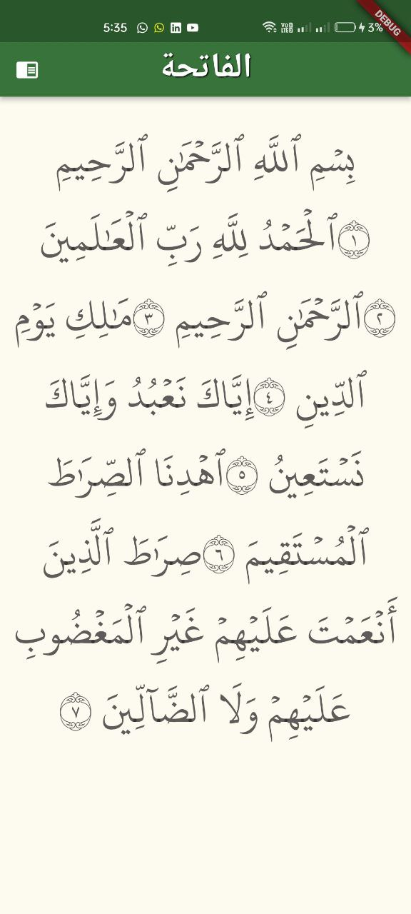

 

  

<h3 align="center">El Quran ElKareem</h3>

  

    El Quran ElKareem shared local DB and Local Json
     
    <a href="https://github.com/itsherifAhmed/quran_kareem"><strong>Explore the docs »</strong></a>
     
     
    <a href="https://github.com/itsherifAhmed/quran_kareem">View Demo</a>
    ·
    <a href="https://github.com/itsherifAhmed/quran_kareem">Report Bug</a>
    ·
    <a href="https://github.com/itsherifAhmed/quran_kareem">Request Feature</a>
  

El Quran El Kareem app is open-source  app for Android & ios. It is built with Dart on top of Google's Flutter Framework.

     

<b>تطبيق القران الكريم</b>

##:rocket: youtube Tutorial

- El Quran ElKareem App by GetX Link: [Quran](https://www.youtube.com/watch?v=Mb10ndQn3yQ&list=PLI36SLicSOmKlHGZRFBl153PHsyAhRF5M)
- Ahadith App by GetX Link: [Ahadith](https://www.youtube.com/watch?v=bHVremPtgNo&t=3668s&ab_channel=SecitDevelopers)
- Youtube App by GetX Link: [youtube](https://www.youtube.com/watch?v=WlEgZKKd_xY&list=PLI36SLicSOmLSQCD1Ccw7gazmeBlcAsAj&index=14)
- Weather App by GetX Link: [youtube](https://www.youtube.com/watch?v=Oo_Wq9YKEc0&list=PLI36SLicSOmLSQCD1Ccw7gazmeBlcAsAj&index=13&ab_channel=SecitDevelopers)
- udemy App by GetX Link: [youtube](https://www.youtube.com/watch?v=nZZ9PsL4z3Q&list=PLI36SLicSOmLSQCD1Ccw7gazmeBlcAsAj&index=12)
- Clock App by GetX Link: [youtube](https://www.youtube.com/watch?v=zfaVN0oZokk&list=PLI36SLicSOmLSQCD1Ccw7gazmeBlcAsAj&index=11)
- Draw App by GetX Link: [youtube](https://www.youtube.com/watch?v=bPLI_o86o1s&list=PLI36SLicSOmLSQCD1Ccw7gazmeBlcAsAj&index=4&ab_channel=SecitDevelopers)
- Quiz App by GetX Link: [Quiz](https://www.youtube.com/watch?v=CasRDoWlPcY&t=899s&ab_channel=SecitDevelopers)
- Note App by GetX Link: [Note](https://www.youtube.com/watch?v=ZrDK3fG4PO0&t=198s&ab_channel=SecitDevelopers)
- news App Api by GetX Link: [News](https://www.youtube.com/watch?v=MFjoIT3RJSc&list=PLI36SLicSOmKQMPwPauvWDARjzrlQyLIo&index=21&ab_channel=SecitDevelopers)
- Ecommerce App by GetX Link: [MakeUp](https://www.youtube.com/watch?v=-bwiujixOpU&list=PLI36SLicSOmKQMPwPauvWDARjzrlQyLIo&index=3&ab_channel=SecitDevelopers)
- Qr Code: [Qr Code](https://www.youtube.com/watch?v=-QCrf5EytSc&list=PLI36SLicSOmLSQCD1Ccw7gazmeBlcAsAj&ab_channel=SecitDevelopers)
- Voice to Text App: [Voice to Text App](https://www.youtube.com/watch?v=dpdnvSI0Dn8&list=PLI36SLicSOmLSQCD1Ccw7gazmeBlcAsAj&index=2&ab_channel=SecitDevelopers)
- GetX EcoSystem playList Link: [PlayList](https://www.youtube.com/watch?v=8Jy4dtQOZMQ&list=PLI36SLicSOmKQMPwPauvWDARjzrlQyLIo&index=1)

## Benfit👻
- [🖥] # Screens 🖥
- [🆗]  HomeScreen
- [🆗] Surah Screen
- [🆗] Setting Screen
--------------------------------
- [🖥] # Deal With 🖥
- [x] Deal With Shared Prefs
- [x] Deal With rootBundle
- [x] Deal With local json 

------------------------------

## Other Flutter Projects 🔐
- [face generator app](https://github.com/itsherifAhmed/face-generator)
- [screen shot lock  ](https://github.com/itsherifAhmed/screen_shot)
- [bg remover app](https://github.com/itsherifAhmed/bg-remover)
- [heart rate app](https://github.com/itsherifAhmed/heart_Rate_App_Camera_And_Flash_Getx)
- [Weather app](https://github.com/itsherifAhmed/Weather_App)
- [udemy clone app](https://github.com/itsherifAhmed/udemy_free_course)
- [clock app](https://github.com/itsherifAhmed/clock-App)
- [برنامج الاحاديث الاربعون النوويه](https://github.com/itsherifAhmed/alnawawiforty)
- [Youtube Clone App](https://github.com/itsherifAhmed/youtube-clone-app-Getx-youtube-Data-api-V3)
- [Quiz App](https://github.com/itsherifAhmed/Quiz-app)
- [News App](https://github.com/itsherifAhmed/NewsApp)
- [Device Detail App](https://github.com/itsherifAhmed/device-detail-app)
- [White board Draw App](https://github.com/itsherifAhmed/draw-app)
- [music app player external storage read](https://github.com/itsherifAhmed/Music-Player-Read-external-Storage-Flutter-app)
- [Make Up App flutter MVC Getx](https://github.com/itsherifAhmed/MakeUp-App)
- [Speech to Text app flutter](https://github.com/itsherifAhmed/Speech-to-text-app)
- [api flutter project](https://github.com/itsherifAhmed/apiFlutter-Project)
- [qr code app](https://github.com/itsherifAhmed/qr-barcode)
- [facebook ui clone](https://github.com/itsherifAhmed/facebook-ui-clone)
- [Login Screen](https://github.com/itsherifAhmed/login-screen)

## Snapshots

| Splash Screen | homw screen Screen                        |
|------|-------------------------------------------|
||  |

| drawer                                      | setting  Page                                |
|---------------------------------------------|----------------------------------------------|
|  |  |

| View One                                     | View Two  Page                               |
|----------------------------------------------|----------------------------------------------|
|  |  |

